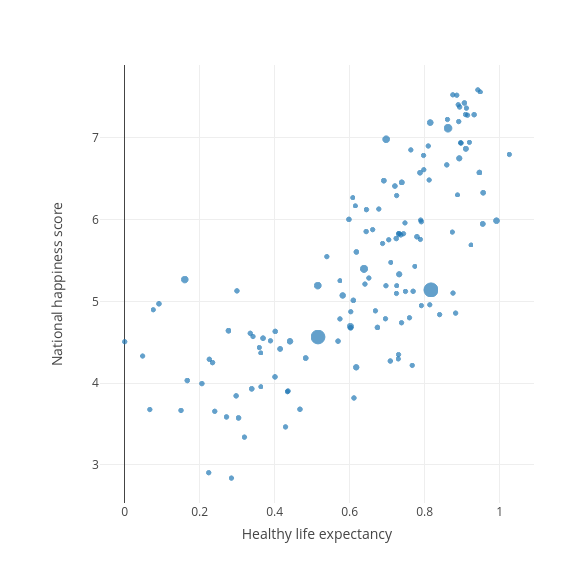
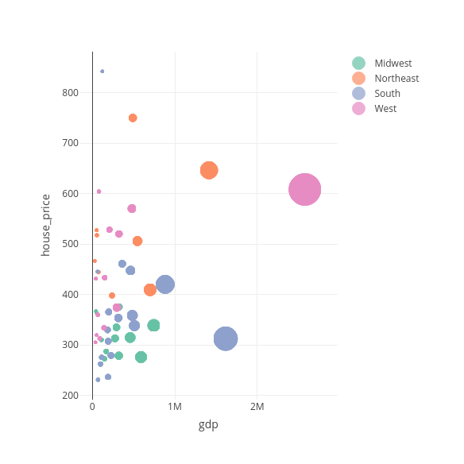

```r
library(plotly)
library(dplyr)

# This dataset wasn't made available by the course, so I created my own, based
# on the UN data available from kaggle.

# Load data
happy <- read.csv("./world-happiness/2015.csv")
population <- read.csv("./world-happiness/populations.csv")
dplyr::glimpse(happy)
```

```
## Rows: 158
## Columns: 12
## $ Country                       <fct> Switzerland, Iceland, D…
## $ Region                        <fct> Western Europe, Western…
## $ Happiness.Rank                <int> 1, 2, 3, 4, 5, 6, 7, 8,…
## $ Happiness.Score               <dbl> 7.587, 7.561, 7.527, 7.…
## $ Standard.Error                <dbl> 0.03411, 0.04884, 0.033…
## $ Economy..GDP.per.Capita.      <dbl> 1.39651, 1.30232, 1.325…
## $ Family                        <dbl> 1.34951, 1.40223, 1.360…
## $ Health..Life.Expectancy.      <dbl> 0.94143, 0.94784, 0.874…
## $ Freedom                       <dbl> 0.66557, 0.62877, 0.649…
## $ Trust..Government.Corruption. <dbl> 0.41978, 0.14145, 0.483…
## $ Generosity                    <dbl> 0.29678, 0.43630, 0.341…
## $ Dystopia.Residual             <dbl> 2.51738, 2.70201, 2.492…
```

```r
dplyr::glimpse(population)
```

```
## Rows: 285
## Columns: 2
## $ Country    <fct> "WORLD", "More developed regions", "Less d…
## $ population <dbl> 7794798.729, 1273304.261, 6521494.468, 105…
```

```r
happy <- merge(happy, population, by = "Country")
dplyr::glimpse(happy)
```

```
## Rows: 136
## Columns: 13
## $ Country                       <fct> Afghanistan, Albania, A…
## $ Region                        <fct> Southern Asia, Central …
## $ Happiness.Rank                <int> 153, 95, 68, 137, 30, 1…
## $ Happiness.Score               <dbl> 3.575, 4.959, 5.605, 4.…
## $ Standard.Error                <dbl> 0.03084, 0.05013, 0.050…
## $ Economy..GDP.per.Capita.      <dbl> 0.31982, 0.87867, 0.939…
## $ Family                        <dbl> 0.30285, 0.80434, 1.077…
## $ Health..Life.Expectancy.      <dbl> 0.30335, 0.81325, 0.617…
## $ Freedom                       <dbl> 0.23414, 0.35733, 0.285…
## $ Trust..Government.Corruption. <dbl> 0.09719, 0.06413, 0.173…
## $ Generosity                    <dbl> 0.36510, 0.14272, 0.078…
## $ Dystopia.Residual             <dbl> 1.95210, 1.89894, 2.432…
## $ population                    <dbl> 38928.341, 2877.800, 43…
```

```r
# Color points based on income
happy %>%
  plot_ly(x = ~Health..Life.Expectancy., y = ~Happiness.Score) %>%
  add_markers(color = ~Economy..GDP.per.Capita.)
```


```r
# Add a categorical variable to separate Economy into four groups
happy$income_cat <- cut(happy$Economy..GDP.per.Capita., 4)

# Plot based on that economic classification
happy %>%
  plot_ly(x = ~Health..Life.Expectancy., y = ~Happiness.Score) %>%
  add_markers(symbol = ~income_cat)
```


```r
# Can also change size based on population
happy %>%
  plot_ly(x = ~Health..Life.Expectancy., y = ~Happiness.Score) %>%
  add_markers(size = ~population)
```

```
## Warning: `line.width` does not currently support multiple
## values.
```


```r
# Add hover information, clean up
happy %>%
  plot_ly(x = ~Health..Life.Expectancy., y = ~Happiness.Score,
          hoverinfo = "text",
          text = ~paste("Country: ", Country,
                        "<br>Population: ", population)) %>%
  add_markers(size = ~population) %>%
  layout(
    xaxis = list(title = "Healthy life expectancy"),
    yaxis = list(title = "National happiness score")
  )
```

```
## Warning: `line.width` does not currently support multiple
## values.
```



```r
# Another pretty graph, this time colored by region and size by log(gdp)
happy %>%
  plot_ly(x = ~Health..Life.Expectancy., y = ~Happiness.Score,
          hoverinfo = "text",
          text = ~paste("Country: ", Country,
                        "<br>Population: ", population)) %>%
  add_markers(color = ~Region, size = ~Economy..GDP.per.Capita.)
```

```
## Warning: `line.width` does not currently support multiple
## values.

## Warning: `line.width` does not currently support multiple
## values.

## Warning: `line.width` does not currently support multiple
## values.

## Warning: `line.width` does not currently support multiple
## values.

## Warning: `line.width` does not currently support multiple
## values.

## Warning: `line.width` does not currently support multiple
## values.

## Warning: `line.width` does not currently support multiple
## values.

## Warning: `line.width` does not currently support multiple
## values.

## Warning: `line.width` does not currently support multiple
## values.

## Warning: `line.width` does not currently support multiple
## values.
```

```
## Warning in RColorBrewer::brewer.pal(N, "Set2"): n too large, allowed maximum for palette Set2 is 8
## Returning the palette you asked for with that many colors

## Warning in RColorBrewer::brewer.pal(N, "Set2"): n too large, allowed maximum for palette Set2 is 8
## Returning the palette you asked for with that many colors
```


```r
# A separate plot, this time of generosity and happiness, with a proper tooltip
happy %>%
  plot_ly(x = ~Generosity, y = ~Happiness.Score,
            hoverinfo = "text",
            text = ~paste("Country: ", Country,
                          "<br> GDP per Capita: ", round(Economy..GDP.per.Capita., 2),
                          "<br> Happiness score: ", round(Happiness.Score, 2),
                          "<br> Happiness rank: ", Happiness.Rank,
                          "<br> Generosity: ", round(Generosity, 2),
                          "<br> Trust in government: ", round(Trust..Government.Corruption., 2))) %>%
  add_markers(symbol = ~income_cat,
              symbols = c("circle-open", "square-open", "star-open", "x-thin-open")) %>%
  layout(xaxis = list(title = "Generosity"),
         yaxis = list(title = "National Happiness Score"))
```


```r
# Second dataset: US economy
us_economy <- read.csv("economic-indicators/state_economic_data.csv")
dplyr::glimpse(economy)
```

```
## Rows: 3,213
## Columns: 9
## $ state       <fct> AK, AK, AK, AK, AK, AK, AK, AK, AK, AK, A…
## $ year        <int> 1997, 1998, 1999, 2000, 2001, 2002, 2003,…
## $ gdp         <dbl> 42262.3, 41157.3, 40721.7, 39516.9, 40973…
## $ employment  <int> NA, NA, NA, NA, NA, NA, 307300, 304900, 3…
## $ home_owners <dbl> 67.2, 66.3, 66.4, 66.4, 65.3, 67.1, 70.0,…
## $ house_price <dbl> 158.7650, 163.6225, 169.3400, 172.2350, 1…
## $ population  <dbl> 608.846, 615.205, 619.500, 627.963, 633.7…
## $ region      <fct> West, West, West, West, West, West, West,…
## $ division    <fct> Pacific, Pacific, Pacific, Pacific, Pacif…
```

```r
# Bubble plot!
us_economy %>%
  filter(year == 2017) %>%
  plot_ly(x = ~gdp, y = ~house_price,
          hoverinfo = "text", text = ~state) %>%
  add_markers(size = ~population, color = ~region,
              marker = list(sizemode = "diameter", sizeref = 2.5))
```

```
## Warning: `line.width` does not currently support multiple
## values.
```

```
## Warning: `line.width` does not currently support multiple
## values.

## Warning: `line.width` does not currently support multiple
## values.

## Warning: `line.width` does not currently support multiple
## values.
```



```r
# Line chart
us_economy %>%
  filter(year >= 2000) %>%
  group_by(state) %>%
  plot_ly(x = ~year, y = ~house_price) %>%
  add_lines()
```


```r
# Animated charts!
us_economy %>%
  plot_ly(x = ~home_owners, y = ~house_price,
          hoverinfo = "text", text = ~state) %>%
  add_markers(size = ~population, frame = ~year,
              color = ~region, ids = ~state) %>%
  layout(xaxis = list(autorange = "reversed"))
```

```
## Warning: `line.width` does not currently support multiple
## values.

## Warning: `line.width` does not currently support multiple
## values.

## Warning: `line.width` does not currently support multiple
## values.

## Warning: `line.width` does not currently support multiple
## values.

## Warning: `line.width` does not currently support multiple
## values.

## Warning: `line.width` does not currently support multiple
## values.

## Warning: `line.width` does not currently support multiple
## values.

## Warning: `line.width` does not currently support multiple
## values.

## Warning: `line.width` does not currently support multiple
## values.

## Warning: `line.width` does not currently support multiple
## values.

## Warning: `line.width` does not currently support multiple
## values.

## Warning: `line.width` does not currently support multiple
## values.

## Warning: `line.width` does not currently support multiple
## values.

## Warning: `line.width` does not currently support multiple
## values.

## Warning: `line.width` does not currently support multiple
## values.

## Warning: `line.width` does not currently support multiple
## values.

## Warning: `line.width` does not currently support multiple
## values.

## Warning: `line.width` does not currently support multiple
## values.

## Warning: `line.width` does not currently support multiple
## values.

## Warning: `line.width` does not currently support multiple
## values.

## Warning: `line.width` does not currently support multiple
## values.

## Warning: `line.width` does not currently support multiple
## values.

## Warning: `line.width` does not currently support multiple
## values.

## Warning: `line.width` does not currently support multiple
## values.

## Warning: `line.width` does not currently support multiple
## values.

## Warning: `line.width` does not currently support multiple
## values.

## Warning: `line.width` does not currently support multiple
## values.

## Warning: `line.width` does not currently support multiple
## values.

## Warning: `line.width` does not currently support multiple
## values.

## Warning: `line.width` does not currently support multiple
## values.

## Warning: `line.width` does not currently support multiple
## values.

## Warning: `line.width` does not currently support multiple
## values.

## Warning: `line.width` does not currently support multiple
## values.

## Warning: `line.width` does not currently support multiple
## values.

## Warning: `line.width` does not currently support multiple
## values.

## Warning: `line.width` does not currently support multiple
## values.

## Warning: `line.width` does not currently support multiple
## values.

## Warning: `line.width` does not currently support multiple
## values.

## Warning: `line.width` does not currently support multiple
## values.

## Warning: `line.width` does not currently support multiple
## values.

## Warning: `line.width` does not currently support multiple
## values.

## Warning: `line.width` does not currently support multiple
## values.

## Warning: `line.width` does not currently support multiple
## values.

## Warning: `line.width` does not currently support multiple
## values.

## Warning: `line.width` does not currently support multiple
## values.

## Warning: `line.width` does not currently support multiple
## values.

## Warning: `line.width` does not currently support multiple
## values.

## Warning: `line.width` does not currently support multiple
## values.

## Warning: `line.width` does not currently support multiple
## values.

## Warning: `line.width` does not currently support multiple
## values.

## Warning: `line.width` does not currently support multiple
## values.

## Warning: `line.width` does not currently support multiple
## values.

## Warning: `line.width` does not currently support multiple
## values.

## Warning: `line.width` does not currently support multiple
## values.

## Warning: `line.width` does not currently support multiple
## values.

## Warning: `line.width` does not currently support multiple
## values.

## Warning: `line.width` does not currently support multiple
## values.

## Warning: `line.width` does not currently support multiple
## values.

## Warning: `line.width` does not currently support multiple
## values.

## Warning: `line.width` does not currently support multiple
## values.

## Warning: `line.width` does not currently support multiple
## values.

## Warning: `line.width` does not currently support multiple
## values.

## Warning: `line.width` does not currently support multiple
## values.

## Warning: `line.width` does not currently support multiple
## values.

## Warning: `line.width` does not currently support multiple
## values.

## Warning: `line.width` does not currently support multiple
## values.

## Warning: `line.width` does not currently support multiple
## values.

## Warning: `line.width` does not currently support multiple
## values.

## Warning: `line.width` does not currently support multiple
## values.

## Warning: `line.width` does not currently support multiple
## values.

## Warning: `line.width` does not currently support multiple
## values.

## Warning: `line.width` does not currently support multiple
## values.

## Warning: `line.width` does not currently support multiple
## values.

## Warning: `line.width` does not currently support multiple
## values.

## Warning: `line.width` does not currently support multiple
## values.

## Warning: `line.width` does not currently support multiple
## values.

## Warning: `line.width` does not currently support multiple
## values.

## Warning: `line.width` does not currently support multiple
## values.

## Warning: `line.width` does not currently support multiple
## values.

## Warning: `line.width` does not currently support multiple
## values.

## Warning: `line.width` does not currently support multiple
## values.

## Warning: `line.width` does not currently support multiple
## values.

## Warning: `line.width` does not currently support multiple
## values.

## Warning: `line.width` does not currently support multiple
## values.
```


