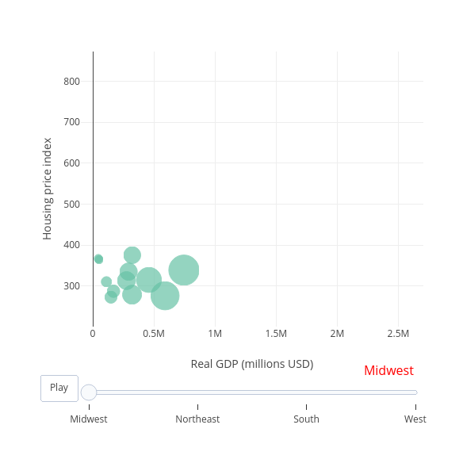
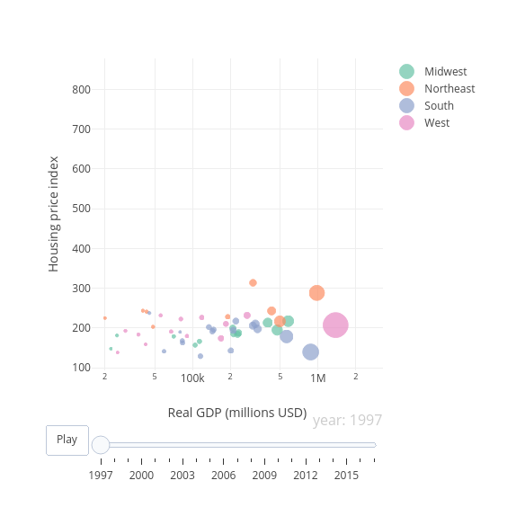
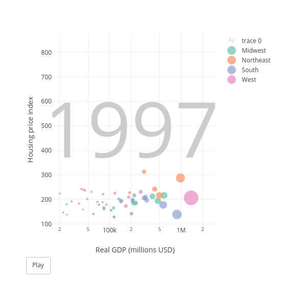
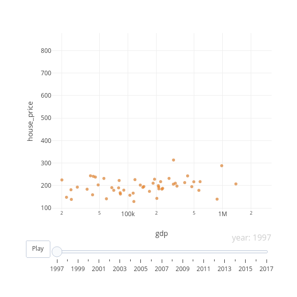

```r
library(plotly)
library(dplyr)

# Load US economy dataset
us_economy <- read.csv("../Chapter-1/economic-indicators/state_economic_data.csv")
dplyr::glimpse(economy)
```

```
## Rows: 3,213
## Columns: 9
## $ state       <fct> AK, AK, AK, AK, AK, AK, AK, AK, AK, AK, AK, AK, AK, AK, AK, AK, AK, AK, AK, AK, AK, AK, AK, AK, AK, AK, AK, AK,…
## $ year        <int> 1997, 1998, 1999, 2000, 2001, 2002, 2003, 2004, 2004, 2004, 2004, 2005, 2005, 2005, 2005, 2006, 2006, 2006, 200…
## $ gdp         <dbl> 42262.3, 41157.3, 40721.7, 39516.9, 40973.8, 42881.0, 42150.5, 43735.3, 43735.3, 43735.3, 43735.3, 45051.6, 450…
## $ employment  <int> NA, NA, NA, NA, NA, NA, 307300, 304900, 305100, 306000, 307400, 311000, 315400, 318500, 320300, 320400, 320200,…
## $ home_owners <dbl> 67.2, 66.3, 66.4, 66.4, 65.3, 67.1, 70.0, 67.2, 67.2, 67.2, 67.2, 66.0, 66.0, 66.0, 66.0, 67.2, 67.2, 67.2, 67.…
## $ house_price <dbl> 158.7650, 163.6225, 169.3400, 172.2350, 180.7975, 190.6550, 199.9350, 220.1050, 220.1050, 220.1050, 220.1050, 2…
## $ population  <dbl> 608.846, 615.205, 619.500, 627.963, 633.714, 642.337, 648.414, 659.286, 659.286, 659.286, 659.286, 666.946, 666…
## $ region      <fct> West, West, West, West, West, West, West, West, West, West, West, West, West, West, West, West, West, West, Wes…
## $ division    <fct> Pacific, Pacific, Pacific, Pacific, Pacific, Pacific, Pacific, Pacific, Pacific, Pacific, Pacific, Pacific, Pac…
```

```r
# Animate a bubble chart of house_price against gdp over region
us_economy %>%
  filter(year == 2017) %>%
  plot_ly(x = ~gdp, y = ~house_price) %>%
  add_markers(size = ~population, color = ~region,
              frame = ~region, ids = ~state,
              marker = list(sizemode = "diameter")) %>%
  animation_opts(frame = 2000, transition = 300, easing = "elastic") %>%
  animation_slider(
    currentvalue = list(
      prefix = "",
      font = list(color="red")
    )
  ) %>%
  layout(
    xaxis = list(title = "Real GDP (millions USD)"),
    yaxis = list(title = "Housing price index")
  )
```

```
## Warning: `line.width` does not currently support multiple values.

## Warning: `line.width` does not currently support multiple values.

## Warning: `line.width` does not currently support multiple values.

## Warning: `line.width` does not currently support multiple values.
```

```
## Warning in p$x$data[firstFrame] <- p$x$frames[[1]]$data: number of items to replace is not a multiple of replacement length
```



```r
# Polish the axis titles and log-transform the x-axis of the original
# bubble chart animation
us_economy %>%
  plot_ly(x = ~gdp, y = ~house_price,
          hoverinfo = "text", text = ~state) %>%
  add_markers(
    size = ~population, color = ~region,
    frame = ~year, ids = ~state,
    marker = list(sizemode = "diameter", sizeref = 3)
  ) %>%
  layout(
    xaxis = list(title = "Real GDP (millions USD)", type = "log"),
    yaxis = list(title = "Housing price index")
  )
```

```
## Warning: `line.width` does not currently support multiple values.
```

```
## Warning: `line.width` does not currently support multiple values.

## Warning: `line.width` does not currently support multiple values.

## Warning: `line.width` does not currently support multiple values.

## Warning: `line.width` does not currently support multiple values.

## Warning: `line.width` does not currently support multiple values.

## Warning: `line.width` does not currently support multiple values.

## Warning: `line.width` does not currently support multiple values.

## Warning: `line.width` does not currently support multiple values.

## Warning: `line.width` does not currently support multiple values.

## Warning: `line.width` does not currently support multiple values.

## Warning: `line.width` does not currently support multiple values.

## Warning: `line.width` does not currently support multiple values.

## Warning: `line.width` does not currently support multiple values.

## Warning: `line.width` does not currently support multiple values.

## Warning: `line.width` does not currently support multiple values.

## Warning: `line.width` does not currently support multiple values.

## Warning: `line.width` does not currently support multiple values.

## Warning: `line.width` does not currently support multiple values.

## Warning: `line.width` does not currently support multiple values.

## Warning: `line.width` does not currently support multiple values.

## Warning: `line.width` does not currently support multiple values.

## Warning: `line.width` does not currently support multiple values.

## Warning: `line.width` does not currently support multiple values.

## Warning: `line.width` does not currently support multiple values.

## Warning: `line.width` does not currently support multiple values.

## Warning: `line.width` does not currently support multiple values.

## Warning: `line.width` does not currently support multiple values.

## Warning: `line.width` does not currently support multiple values.

## Warning: `line.width` does not currently support multiple values.

## Warning: `line.width` does not currently support multiple values.

## Warning: `line.width` does not currently support multiple values.

## Warning: `line.width` does not currently support multiple values.

## Warning: `line.width` does not currently support multiple values.

## Warning: `line.width` does not currently support multiple values.

## Warning: `line.width` does not currently support multiple values.

## Warning: `line.width` does not currently support multiple values.

## Warning: `line.width` does not currently support multiple values.

## Warning: `line.width` does not currently support multiple values.

## Warning: `line.width` does not currently support multiple values.

## Warning: `line.width` does not currently support multiple values.

## Warning: `line.width` does not currently support multiple values.

## Warning: `line.width` does not currently support multiple values.

## Warning: `line.width` does not currently support multiple values.

## Warning: `line.width` does not currently support multiple values.

## Warning: `line.width` does not currently support multiple values.

## Warning: `line.width` does not currently support multiple values.

## Warning: `line.width` does not currently support multiple values.

## Warning: `line.width` does not currently support multiple values.

## Warning: `line.width` does not currently support multiple values.

## Warning: `line.width` does not currently support multiple values.

## Warning: `line.width` does not currently support multiple values.

## Warning: `line.width` does not currently support multiple values.

## Warning: `line.width` does not currently support multiple values.

## Warning: `line.width` does not currently support multiple values.

## Warning: `line.width` does not currently support multiple values.

## Warning: `line.width` does not currently support multiple values.

## Warning: `line.width` does not currently support multiple values.

## Warning: `line.width` does not currently support multiple values.

## Warning: `line.width` does not currently support multiple values.

## Warning: `line.width` does not currently support multiple values.

## Warning: `line.width` does not currently support multiple values.

## Warning: `line.width` does not currently support multiple values.

## Warning: `line.width` does not currently support multiple values.

## Warning: `line.width` does not currently support multiple values.

## Warning: `line.width` does not currently support multiple values.

## Warning: `line.width` does not currently support multiple values.

## Warning: `line.width` does not currently support multiple values.

## Warning: `line.width` does not currently support multiple values.

## Warning: `line.width` does not currently support multiple values.

## Warning: `line.width` does not currently support multiple values.

## Warning: `line.width` does not currently support multiple values.

## Warning: `line.width` does not currently support multiple values.

## Warning: `line.width` does not currently support multiple values.

## Warning: `line.width` does not currently support multiple values.

## Warning: `line.width` does not currently support multiple values.

## Warning: `line.width` does not currently support multiple values.

## Warning: `line.width` does not currently support multiple values.

## Warning: `line.width` does not currently support multiple values.

## Warning: `line.width` does not currently support multiple values.

## Warning: `line.width` does not currently support multiple values.

## Warning: `line.width` does not currently support multiple values.

## Warning: `line.width` does not currently support multiple values.

## Warning: `line.width` does not currently support multiple values.
```



```r
# Adding layers
# Add the year as background text and remove the slider
us_economy %>%
  plot_ly(x = ~gdp, y = ~house_price, hoverinfo = "text", text = ~state) %>%
  add_text(x = 200000, y = 450, text = ~year, frame = ~year,
           textfont = list(color = toRGB("gray80"), size = 150),
           ids = ~1) %>%
  add_markers(size = ~population, color = ~region,
              frame = ~year, ids = ~state,
              marker = list(sizemode = "diameter", sizeref = 3)) %>%
  layout(xaxis = list(title = "Real GDP (millions USD)", type = "log"),
         yaxis = list(title = "Housing price index")) %>%
  animation_slider(hide = TRUE)
```

```
## Warning: `line.width` does not currently support multiple values.

## Warning: `line.width` does not currently support multiple values.

## Warning: `line.width` does not currently support multiple values.

## Warning: `line.width` does not currently support multiple values.

## Warning: `line.width` does not currently support multiple values.

## Warning: `line.width` does not currently support multiple values.

## Warning: `line.width` does not currently support multiple values.

## Warning: `line.width` does not currently support multiple values.

## Warning: `line.width` does not currently support multiple values.

## Warning: `line.width` does not currently support multiple values.

## Warning: `line.width` does not currently support multiple values.

## Warning: `line.width` does not currently support multiple values.

## Warning: `line.width` does not currently support multiple values.

## Warning: `line.width` does not currently support multiple values.

## Warning: `line.width` does not currently support multiple values.

## Warning: `line.width` does not currently support multiple values.

## Warning: `line.width` does not currently support multiple values.

## Warning: `line.width` does not currently support multiple values.

## Warning: `line.width` does not currently support multiple values.

## Warning: `line.width` does not currently support multiple values.

## Warning: `line.width` does not currently support multiple values.

## Warning: `line.width` does not currently support multiple values.

## Warning: `line.width` does not currently support multiple values.

## Warning: `line.width` does not currently support multiple values.

## Warning: `line.width` does not currently support multiple values.

## Warning: `line.width` does not currently support multiple values.

## Warning: `line.width` does not currently support multiple values.

## Warning: `line.width` does not currently support multiple values.

## Warning: `line.width` does not currently support multiple values.

## Warning: `line.width` does not currently support multiple values.

## Warning: `line.width` does not currently support multiple values.

## Warning: `line.width` does not currently support multiple values.

## Warning: `line.width` does not currently support multiple values.

## Warning: `line.width` does not currently support multiple values.

## Warning: `line.width` does not currently support multiple values.

## Warning: `line.width` does not currently support multiple values.

## Warning: `line.width` does not currently support multiple values.

## Warning: `line.width` does not currently support multiple values.

## Warning: `line.width` does not currently support multiple values.

## Warning: `line.width` does not currently support multiple values.

## Warning: `line.width` does not currently support multiple values.

## Warning: `line.width` does not currently support multiple values.

## Warning: `line.width` does not currently support multiple values.

## Warning: `line.width` does not currently support multiple values.

## Warning: `line.width` does not currently support multiple values.

## Warning: `line.width` does not currently support multiple values.

## Warning: `line.width` does not currently support multiple values.

## Warning: `line.width` does not currently support multiple values.

## Warning: `line.width` does not currently support multiple values.

## Warning: `line.width` does not currently support multiple values.

## Warning: `line.width` does not currently support multiple values.

## Warning: `line.width` does not currently support multiple values.

## Warning: `line.width` does not currently support multiple values.

## Warning: `line.width` does not currently support multiple values.

## Warning: `line.width` does not currently support multiple values.

## Warning: `line.width` does not currently support multiple values.

## Warning: `line.width` does not currently support multiple values.

## Warning: `line.width` does not currently support multiple values.

## Warning: `line.width` does not currently support multiple values.

## Warning: `line.width` does not currently support multiple values.

## Warning: `line.width` does not currently support multiple values.

## Warning: `line.width` does not currently support multiple values.

## Warning: `line.width` does not currently support multiple values.

## Warning: `line.width` does not currently support multiple values.

## Warning: `line.width` does not currently support multiple values.

## Warning: `line.width` does not currently support multiple values.

## Warning: `line.width` does not currently support multiple values.

## Warning: `line.width` does not currently support multiple values.

## Warning: `line.width` does not currently support multiple values.

## Warning: `line.width` does not currently support multiple values.

## Warning: `line.width` does not currently support multiple values.

## Warning: `line.width` does not currently support multiple values.

## Warning: `line.width` does not currently support multiple values.

## Warning: `line.width` does not currently support multiple values.

## Warning: `line.width` does not currently support multiple values.

## Warning: `line.width` does not currently support multiple values.

## Warning: `line.width` does not currently support multiple values.

## Warning: `line.width` does not currently support multiple values.

## Warning: `line.width` does not currently support multiple values.

## Warning: `line.width` does not currently support multiple values.

## Warning: `line.width` does not currently support multiple values.

## Warning: `line.width` does not currently support multiple values.

## Warning: `line.width` does not currently support multiple values.

## Warning: `line.width` does not currently support multiple values.
```



```r
# extract the 1997 data
us1997 <- us_economy %>%
  filter(year == 1997)

# create an animated scatterplot with baseline from 1997
us_economy %>%
  plot_ly(x = ~gdp, y = ~house_price) %>%
  add_markers(data = us1997, marker = list(color = toRGB("gray60"), opacity = 0.5)) %>%
  add_markers(frame = ~year, ids = ~state, data = us_economy, showlegend = FALSE, alpha = 0.5) %>%
  layout(xaxis = list(type = "log"))
```



