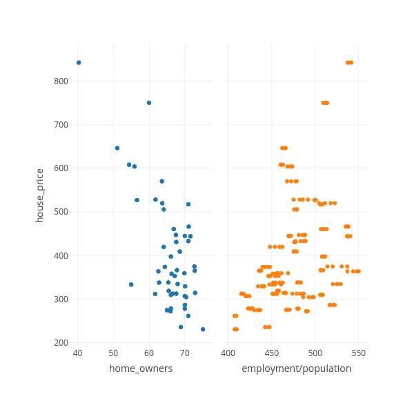
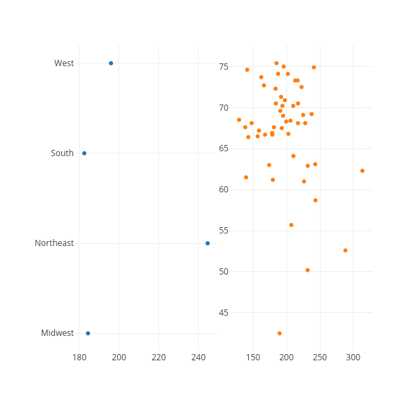
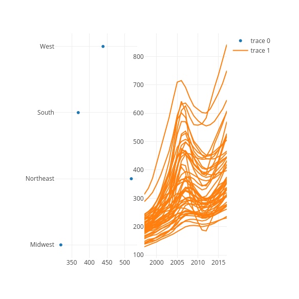
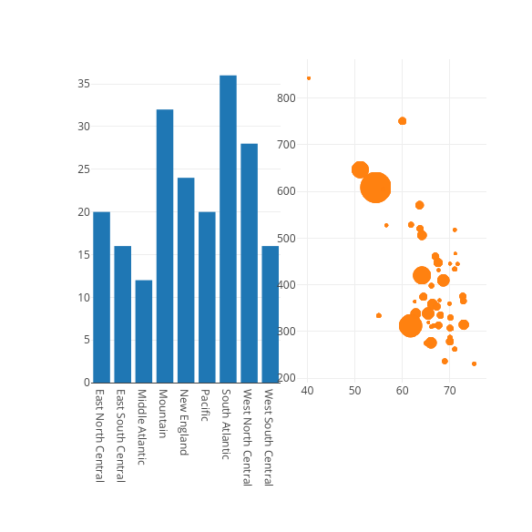
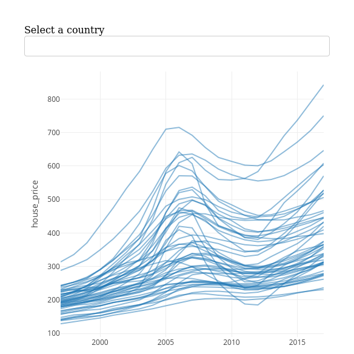
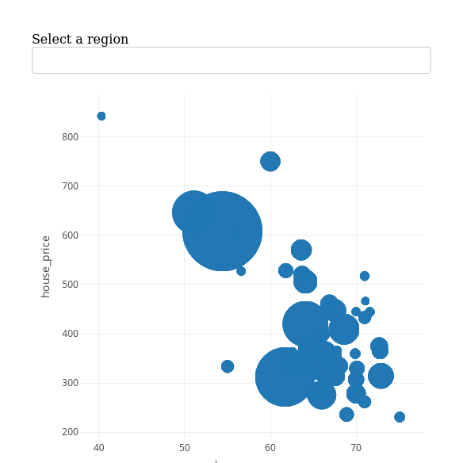

```r
library(plotly)
library(dplyr)
library(crosstalk)

# Load US economy dataset
us_economy <- read.csv("../Chapter-1/economic-indicators/state_economic_data.csv")
dplyr::glimpse(us_economy)
```

```
## Rows: 3,213
## Columns: 9
## $ state       <fct> AK, AK, AK, AK, AK, AK, AK, AK, AK, AK, AK, AK, AK, AK, AK, AK, AK, AK, AK, AK, AK, AK, AK, AK, AK, AK, AK, AK,…
## $ year        <int> 1997, 1998, 1999, 2000, 2001, 2002, 2003, 2004, 2004, 2004, 2004, 2005, 2005, 2005, 2005, 2006, 2006, 2006, 200…
## $ gdp         <dbl> 42262.3, 41157.3, 40721.7, 39516.9, 40973.8, 42881.0, 42150.5, 43735.3, 43735.3, 43735.3, 43735.3, 45051.6, 450…
## $ employment  <int> NA, NA, NA, NA, NA, NA, 307300, 304900, 305100, 306000, 307400, 311000, 315400, 318500, 320300, 320400, 320200,…
## $ home_owners <dbl> 67.2, 66.3, 66.4, 66.4, 65.3, 67.1, 70.0, 67.2, 67.2, 67.2, 67.2, 66.0, 66.0, 66.0, 66.0, 67.2, 67.2, 67.2, 67.…
## $ house_price <dbl> 158.7650, 163.6225, 169.3400, 172.2350, 180.7975, 190.6550, 199.9350, 220.1050, 220.1050, 220.1050, 220.1050, 2…
## $ population  <dbl> 608.846, 615.205, 619.500, 627.963, 633.714, 642.337, 648.414, 659.286, 659.286, 659.286, 659.286, 666.946, 666…
## $ region      <fct> West, West, West, West, West, West, West, West, West, West, West, West, West, West, West, West, West, West, Wes…
## $ division    <fct> Pacific, Pacific, Pacific, Pacific, Pacific, Pacific, Pacific, Pacific, Pacific, Pacific, Pacific, Pacific, Pac…
```

```r
# Create a smaller dataset
us2017 <- us_economy %>%
  filter(year == 2017)

# Put into a SharedData object for crosstalk
shared_us <- SharedData$new(us2017)

# Create a scatterplot of house_price vs. home_owners
p1 <- shared_us %>%
  plot_ly(x = ~home_owners, y = ~house_price) %>%
  add_markers()

# Scatterplot of house_price vs. employment rate
p2 <- shared_us %>%
  plot_ly(x = ~employment/population, y = ~house_price) %>%
  add_markers()

# Combine the plots
subplot(p1, p2, titleX = TRUE, shareY = TRUE) %>%
  hide_legend() %>%
  highlight(on = "plotly_selected")
```

```
## Setting the `off` event (i.e., 'plotly_deselect') to match the `on` event (i.e., 'plotly_selected'). You can change this default via the `highlight()` function.
```



```r
# Example
world_indicators %>%
  SharedData$new(key = ~country) %>%
  plot_ly(x = ~year, y = ~income, alpha = 0.5) %>%
  group_by(country) %>%
  add_lines
```

```
## Error in eval(lhs, parent, parent): object 'world_indicators' not found
```

```r
# Practice
shared_data <- us_economy %>%
  filter(year == 1997) %>%
  SharedData$new(key = ~region)

# Create a scatterplot of house_price vs. home_owners
p1 <- shared_data %>%
  plot_ly(hoverinfo = "text", text = ~region) %>%
  group_by(region) %>%
  summarize(avg.housep = mean(house_price, na.rm = TRUE)) %>%
  add_markers(x = ~avg.housep, y = ~region)

# Scatterplot of house_price vs. employment rate
p2 <- shared_data %>%
  plot_ly(x = ~house_price, y = ~home_owners, text = ~state) %>%
  add_markers()

subplot(p1, p2) %>% hide_legend()
```



```r
# Dotplot example (in course)

# Create a shared data object keyed by region
shared_region <- SharedData$new(us_economy, key = ~region)

# Create a dotplot of avg house_price by region in 2017
dp_chart <- shared_region %>%
  plot_ly() %>%
  filter(year == 2017) %>%
  group_by(region) %>%
  summarize(avg.hpi = mean(house_price, na.rm = TRUE)) %>%
  add_markers(x = ~avg.hpi, y = ~region)

# Code for time series plot
ts_chart <- shared_region %>%
  plot_ly(x = ~year, y = ~house_price, hoverinfo = "text", text = ~state) %>%
  group_by(state) %>%
  add_lines()

subplot(dp_chart, ts_chart)
```



```r
# Create a shared data object keyed by division
shared_div <- SharedData$new(us2017, key = ~division)

# Create a bar chart for division
bc <- shared_div %>%
  plot_ly() %>%
  count(division) %>%
  add_bars(x = ~division, y = ~n) %>%
  layout(barmode = "overlay")

# Bubble chart
bubble <- shared_div %>%
  plot_ly(x = ~home_owners, y = ~house_price, hoverinfo = "text", text = ~state) %>%
  add_markers(size = ~population, marker = list(sizemode = "diameter", sizeref=3))

# Link bc and bubble
subplot(bc, bubble) %>% hide_legend()
```

```
## Warning: `line.width` does not currently support multiple values.
```



```r
## Persistent selection
subplot(bc, bubble) %>% hide_legend() %>%
  highlight(persistent = TRUE, dynamic = TRUE)
```

```
## Warning: `line.width` does not currently support multiple values.
```

```
## Adding more colors to the selection color palette.
```

```
## We recommend setting `persistent` to `FALSE` (the default) because persistent selection mode can now be used by holding the shift key (while triggering the `on` event).
```

```
## Setting the `off` event (i.e., 'plotly_doubleclick') to match the `on` event (i.e., 'plotly_click'). You can change this default via the `highlight()` function.
```


```r
## Drop-down selection
us_economy %>%
  SharedData$new(key = ~state, group = "Select a country") %>%
  plot_ly(x = ~year, y = ~house_price, alpha = 0.5,
          hoverinfo = "text", text = ~state) %>%
  group_by(state) %>%
  add_lines() %>%
  highlight(selectize = TRUE)
```

```
## Setting the `off` event (i.e., 'plotly_doubleclick') to match the `on` event (i.e., 'plotly_click'). You can change this default via the `highlight()` function.
```



```r
# Create a shared data object keyed by region
region_data <- SharedData$new(us2017, key = ~region, group = "Select a region")

# Enable indirect selection by region
region_data %>%
  plot_ly(x = ~home_owners, y = ~house_price, hoverinfo = "text", text = ~state) %>%
  add_markers(size = ~population, marker = list(sizemode = "diameter")) %>%
  highlight(selectize = TRUE)
```

```
## Warning: `line.width` does not currently support multiple values.
```

```
## Setting the `off` event (i.e., 'plotly_doubleclick') to match the `on` event (i.e., 'plotly_click'). You can change this default via the `highlight()` function.
```



```r
# Making a version with selector widgets
bscols(widths = c(2, 5, 5),
       list(
  filter_slider(id  = "house", label = "House Price",
                       sharedData = shared_div, column = ~house_price),
       filter_select(id = "division", label = "Region",
                     sharedData = shared_div, group = ~division)),
       bubble %>% layout(yaxis = list(range = c(0, 900)),
                         xaxis = list(range = c(0, 100))))
```

```
## Warning in bscols(widths = c(2, 5, 5), list(filter_slider(id = "house", : Too many widths provided to bscols; truncating

## Warning in bscols(widths = c(2, 5, 5), list(filter_slider(id = "house", : `line.width` does not currently support multiple values.
```

<!--html_preserve--><div class="container-fluid crosstalk-bscols">
<div class="fluid-row">
<div class="col-xs-2">
<div class="form-group crosstalk-input crosstalk-input-slider js-range-slider" id="house">
<label class="control-label" for="house">House Price</label>
<input data-type="double" data-min="230.9575" data-max="842.3675" data-from="230.9575" data-to="842.3675" data-step="5" data-grid="true" data-grid-num="9.40630769230769" data-grid-snap="false" data-prettify-separator="," data-keyboard="true" data-keyboard-step="0.81778184851409" data-drag-interval="true" data-data-type="number"/>
<script type="application/json" data-for="house">{
  "values": [230.9575, 230.9575, 230.9575, 230.9575, 236.23, 236.23, 236.23, 236.23, 261.9775, 261.9775, 261.9775, 261.9775, 272.44, 272.44, 272.44, 272.44, 275.095, 275.095, 275.095, 275.095, 275.8375, 275.8375, 275.8375, 275.8375, 278.475, 278.475, 278.475, 278.475, 278.905, 278.905, 278.905, 278.905, 287.005, 287.005, 287.005, 287.005, 304.99, 304.99, 304.99, 304.99, 307.22, 307.22, 307.22, 307.22, 310.0325, 310.0325, 310.0325, 310.0325, 312.2975, 312.2975, 312.2975, 312.2975, 312.7375, 312.7375, 312.7375, 312.7375, 312.9025, 312.9025, 312.9025, 312.9025, 314.6275, 314.6275, 314.6275, 314.6275, 319.2875, 319.2875, 319.2875, 319.2875, 329.7025, 329.7025, 329.7025, 329.7025, 333.7025, 333.7025, 333.7025, 333.7025, 334.8225, 334.8225, 334.8225, 334.8225, 338.16, 338.16, 338.16, 338.16, 338.4825, 338.4825, 338.4825, 338.4825, 353.345, 353.345, 353.345, 353.345, 358.445, 358.445, 358.445, 358.445, 359.6975, 359.6975, 359.6975, 359.6975, 363.92, 363.92, 363.92, 363.92, 365.345, 365.345, 365.345, 365.345, 366.6675, 366.6675, 366.6675, 366.6675, 374.105, 374.105, 374.105, 374.105, 375.1775, 375.1775, 375.1775, 375.1775, 397.97, 397.97, 397.97, 397.97, 409.3475, 409.3475, 409.3475, 409.3475, 420.0125, 420.0125, 420.0125, 420.0125, 431.2225, 431.2225, 431.2225, 431.2225, 433.29, 433.29, 433.29, 433.29, 444.38, 444.38, 444.38, 444.38, 445.155, 445.155, 445.155, 445.155, 447.3425, 447.3425, 447.3425, 447.3425, 460.85, 460.85, 460.85, 460.85, 466.4925, 466.4925, 466.4925, 466.4925, 505.915, 505.915, 505.915, 505.915, 517.5225, 517.5225, 517.5225, 517.5225, 520.1175, 520.1175, 520.1175, 520.1175, 527.3075, 527.3075, 527.3075, 527.3075, 528.365, 528.365, 528.365, 528.365, 570.3775, 570.3775, 570.3775, 570.3775, 604.1725, 604.1725, 604.1725, 604.1725, 608.2725, 608.2725, 608.2725, 608.2725, 646.3725, 646.3725, 646.3725, 646.3725, 750.1125, 750.1125, 750.1125, 750.1125, 842.3675, 842.3675, 842.3675, 842.3675],
  "keys": ["South Atlantic", "South Atlantic", "South Atlantic", "South Atlantic", "West South Central", "West South Central", "West South Central", "West South Central", "East South Central", "East South Central", "East South Central", "East South Central", "West North Central", "West North Central", "West North Central", "West North Central", "West South Central", "West South Central", "West South Central", "West South Central", "East North Central", "East North Central", "East North Central", "East North Central", "East North Central", "East North Central", "East North Central", "East North Central", "West South Central", "West South Central", "West South Central", "West South Central", "West North Central", "West North Central", "West North Central", "West North Central", "Mountain", "Mountain", "Mountain", "Mountain", "East South Central", "East South Central", "East South Central", "East South Central", "West North Central", "West North Central", "West North Central", "West North Central", "West South Central", "West South Central", "West South Central", "West South Central", "Mountain", "Mountain", "Mountain", "Mountain", "West North Central", "West North Central", "West North Central", "West North Central", "East North Central", "East North Central", "East North Central", "East North Central", "Pacific", "Pacific", "Pacific", "Pacific", "East South Central", "East South Central", "East South Central", "East South Central", "Mountain", "Mountain", "Mountain", "Mountain", "East North Central", "East North Central", "East North Central", "East North Central", "South Atlantic", "South Atlantic", "South Atlantic", "South Atlantic", "East North Central", "East North Central", "East North Central", "East North Central", "East South Central", "East South Central", "East South Central", "East South Central", "South Atlantic", "South Atlantic", "South Atlantic", "South Atlantic", "Mountain", "Mountain", "Mountain", "Mountain", "West North Central", "West North Central", "West North Central", "West North Central", "South Atlantic", "South Atlantic", "South Atlantic", "South Atlantic", "West North Central", "West North Central", "West North Central", "West North Central", "Mountain", "Mountain", "Mountain", "Mountain", "West North Central", "West North Central", "West North Central", "West North Central", "New England", "New England", "New England", "New England", "Middle Atlantic", "Middle Atlantic", "Middle Atlantic", "Middle Atlantic", "South Atlantic", "South Atlantic", "South Atlantic", "South Atlantic", "Mountain", "Mountain", "Mountain", "Mountain", "Mountain", "Mountain", "Mountain", "Mountain", "New England", "New England", "New England", "New England", "South Atlantic", "South Atlantic", "South Atlantic", "South Atlantic", "South Atlantic", "South Atlantic", "South Atlantic", "South Atlantic", "South Atlantic", "South Atlantic", "South Atlantic", "South Atlantic", "New England", "New England", "New England", "New England", "Middle Atlantic", "Middle Atlantic", "Middle Atlantic", "Middle Atlantic", "New England", "New England", "New England", "New England", "Mountain", "Mountain", "Mountain", "Mountain", "New England", "New England", "New England", "New England", "Pacific", "Pacific", "Pacific", "Pacific", "Pacific", "Pacific", "Pacific", "Pacific", "Pacific", "Pacific", "Pacific", "Pacific", "Pacific", "Pacific", "Pacific", "Pacific", "Middle Atlantic", "Middle Atlantic", "Middle Atlantic", "Middle Atlantic", "New England", "New England", "New England", "New England", "South Atlantic", "South Atlantic", "South Atlantic", "South Atlantic"],
  "group": ["SharedData80e403ee"]
}</script>
</div>
<div id="division" class="form-group crosstalk-input-select crosstalk-input">
<label class="control-label" for="division">Region</label>
<div>
<select multiple></select>
<script type="application/json" data-for="division">{
  "items": {
    "value": ["East North Central", "East South Central", "Middle Atlantic", "Mountain", "New England", "Pacific", "South Atlantic", "West North Central", "West South Central"],
    "label": ["East North Central", "East South Central", "Middle Atlantic", "Mountain", "New England", "Pacific", "South Atlantic", "West North Central", "West South Central"]
  },
  "map": {
    "East North Central": ["East North Central", "East North Central", "East North Central", "East North Central", "East North Central", "East North Central", "East North Central", "East North Central", "East North Central", "East North Central", "East North Central", "East North Central", "East North Central", "East North Central", "East North Central", "East North Central", "East North Central", "East North Central", "East North Central", "East North Central"],
    "East South Central": ["East South Central", "East South Central", "East South Central", "East South Central", "East South Central", "East South Central", "East South Central", "East South Central", "East South Central", "East South Central", "East South Central", "East South Central", "East South Central", "East South Central", "East South Central", "East South Central"],
    "Middle Atlantic": ["Middle Atlantic", "Middle Atlantic", "Middle Atlantic", "Middle Atlantic", "Middle Atlantic", "Middle Atlantic", "Middle Atlantic", "Middle Atlantic", "Middle Atlantic", "Middle Atlantic", "Middle Atlantic", "Middle Atlantic"],
    "Mountain": ["Mountain", "Mountain", "Mountain", "Mountain", "Mountain", "Mountain", "Mountain", "Mountain", "Mountain", "Mountain", "Mountain", "Mountain", "Mountain", "Mountain", "Mountain", "Mountain", "Mountain", "Mountain", "Mountain", "Mountain", "Mountain", "Mountain", "Mountain", "Mountain", "Mountain", "Mountain", "Mountain", "Mountain", "Mountain", "Mountain", "Mountain", "Mountain"],
    "New England": ["New England", "New England", "New England", "New England", "New England", "New England", "New England", "New England", "New England", "New England", "New England", "New England", "New England", "New England", "New England", "New England", "New England", "New England", "New England", "New England", "New England", "New England", "New England", "New England"],
    "Pacific": ["Pacific", "Pacific", "Pacific", "Pacific", "Pacific", "Pacific", "Pacific", "Pacific", "Pacific", "Pacific", "Pacific", "Pacific", "Pacific", "Pacific", "Pacific", "Pacific", "Pacific", "Pacific", "Pacific", "Pacific"],
    "South Atlantic": ["South Atlantic", "South Atlantic", "South Atlantic", "South Atlantic", "South Atlantic", "South Atlantic", "South Atlantic", "South Atlantic", "South Atlantic", "South Atlantic", "South Atlantic", "South Atlantic", "South Atlantic", "South Atlantic", "South Atlantic", "South Atlantic", "South Atlantic", "South Atlantic", "South Atlantic", "South Atlantic", "South Atlantic", "South Atlantic", "South Atlantic", "South Atlantic", "South Atlantic", "South Atlantic", "South Atlantic", "South Atlantic", "South Atlantic", "South Atlantic", "South Atlantic", "South Atlantic", "South Atlantic", "South Atlantic", "South Atlantic", "South Atlantic"],
    "West North Central": ["West North Central", "West North Central", "West North Central", "West North Central", "West North Central", "West North Central", "West North Central", "West North Central", "West North Central", "West North Central", "West North Central", "West North Central", "West North Central", "West North Central", "West North Central", "West North Central", "West North Central", "West North Central", "West North Central", "West North Central", "West North Central", "West North Central", "West North Central", "West North Central", "West North Central", "West North Central", "West North Central", "West North Central"],
    "West South Central": ["West South Central", "West South Central", "West South Central", "West South Central", "West South Central", "West South Central", "West South Central", "West South Central", "West South Central", "West South Central", "West South Central", "West South Central", "West South Central", "West South Central", "West South Central", "West South Central"]
  },
  "group": ["SharedData80e403ee"]
}</script>
</div>
</div>
</div>
<div class="col-xs-5">
<div id="htmlwidget-524609caed3b0a82286b" style="width:100%;height:400px;" class="plotly html-widget"></div>
<script type="application/json" data-for="htmlwidget-524609caed3b0a82286b">{"x":{"visdat":{"9ec3d395a0983":["function () ","plotlyVisDat"]},"cur_data":"9ec3d395a0983","attrs":{"9ec3d395a0983":{"x":{},"y":{},"hoverinfo":"text","text":{},"alpha_stroke":1,"sizes":[10,100],"spans":[1,20],"type":"scatter","mode":"markers","size":{},"marker":{"sizemode":"diameter","sizeref":3},"inherit":true}},"layout":{"margin":{"b":40,"l":60,"t":25,"r":10},"yaxis":{"domain":[0,1],"automargin":true,"range":[0,900],"title":"house_price"},"xaxis":{"domain":[0,1],"automargin":true,"range":[0,100],"title":"home_owners"},"dragmode":"zoom","hovermode":"closest","showlegend":false},"source":"A","config":{"showSendToCloud":false},"data":[{"x":[65.5,65.5,65.5,65.5,70,70,70,70,65,65,65,65,64.4,64.4,64.4,64.4,54.4,54.4,54.4,54.4,63.7,63.7,63.7,63.7,66.1,66.1,66.1,66.1,40.3,40.3,40.3,40.3,70,70,70,70,64.1,64.1,64.1,64.1,62.8,62.8,62.8,62.8,55.9,55.9,55.9,55.9,70,70,70,70,69.9,69.9,69.9,69.9,65.4,65.4,65.4,65.4,70,70,70,70,66,66,66,66,70.1,70.1,70.1,70.1,66.1,66.1,66.1,66.1,60,60,60,60,66.9,66.9,66.9,66.9,71,71,71,71,72.9,72.9,72.9,72.9,72.7,72.7,72.7,72.7,67.6,67.6,67.6,67.6,71,71,71,71,67.6,67.6,67.6,67.6,66.3,66.3,66.3,66.3,62.6,62.6,62.6,62.6,66.1,66.1,66.1,66.1,71.6,71.6,71.6,71.6,64.1,64.1,64.1,64.1,66.6,66.6,66.6,66.6,55,55,55,55,51.1,51.1,51.1,51.1,66,66,66,66,68.9,68.9,68.9,68.9,61.8,61.8,61.8,61.8,68.6,68.6,68.6,68.6,56.6,56.6,56.6,56.6,72.8,72.8,72.8,72.8,67.8,67.8,67.8,67.8,67.2,67.2,67.2,67.2,61.7,61.7,61.7,61.7,71,71,71,71,67.5,67.5,67.5,67.5,71.1,71.1,71.1,71.1,63.6,63.6,63.6,63.6,68,68,68,68,75.1,75.1,75.1,75.1,70.4,70.4,70.4,70.4],"y":[319.2875,319.2875,319.2875,319.2875,307.22,307.22,307.22,307.22,275.095,275.095,275.095,275.095,374.105,374.105,374.105,374.105,608.2725,608.2725,608.2725,608.2725,520.1175,520.1175,520.1175,520.1175,397.97,397.97,397.97,397.97,842.3675,842.3675,842.3675,842.3675,445.155,445.155,445.155,445.155,420.0125,420.0125,420.0125,420.0125,338.16,338.16,338.16,338.16,604.1725,604.1725,604.1725,604.1725,287.005,287.005,287.005,287.005,359.6975,359.6975,359.6975,359.6975,338.4825,338.4825,338.4825,338.4825,278.475,278.475,278.475,278.475,272.44,272.44,272.44,272.44,329.7025,329.7025,329.7025,329.7025,278.905,278.905,278.905,278.905,750.1125,750.1125,750.1125,750.1125,460.85,460.85,460.85,460.85,517.5225,517.5225,517.5225,517.5225,314.6275,314.6275,314.6275,314.6275,375.1775,375.1775,375.1775,375.1775,312.9025,312.9025,312.9025,312.9025,261.9775,261.9775,261.9775,261.9775,431.2225,431.2225,431.2225,431.2225,358.445,358.445,358.445,358.445,363.92,363.92,363.92,363.92,310.0325,310.0325,310.0325,310.0325,444.38,444.38,444.38,444.38,505.915,505.915,505.915,505.915,312.7375,312.7375,312.7375,312.7375,333.7025,333.7025,333.7025,333.7025,646.3725,646.3725,646.3725,646.3725,275.8375,275.8375,275.8375,275.8375,236.23,236.23,236.23,236.23,528.365,528.365,528.365,528.365,409.3475,409.3475,409.3475,409.3475,527.3075,527.3075,527.3075,527.3075,365.345,365.345,365.345,365.345,366.6675,366.6675,366.6675,366.6675,353.345,353.345,353.345,353.345,312.2975,312.2975,312.2975,312.2975,433.29,433.29,433.29,433.29,447.3425,447.3425,447.3425,447.3425,466.4925,466.4925,466.4925,466.4925,570.3775,570.3775,570.3775,570.3775,334.8225,334.8225,334.8225,334.8225,230.9575,230.9575,230.9575,230.9575,304.99,304.99,304.99,304.99],"hoverinfo":["text","text","text","text","text","text","text","text","text","text","text","text","text","text","text","text","text","text","text","text","text","text","text","text","text","text","text","text","text","text","text","text","text","text","text","text","text","text","text","text","text","text","text","text","text","text","text","text","text","text","text","text","text","text","text","text","text","text","text","text","text","text","text","text","text","text","text","text","text","text","text","text","text","text","text","text","text","text","text","text","text","text","text","text","text","text","text","text","text","text","text","text","text","text","text","text","text","text","text","text","text","text","text","text","text","text","text","text","text","text","text","text","text","text","text","text","text","text","text","text","text","text","text","text","text","text","text","text","text","text","text","text","text","text","text","text","text","text","text","text","text","text","text","text","text","text","text","text","text","text","text","text","text","text","text","text","text","text","text","text","text","text","text","text","text","text","text","text","text","text","text","text","text","text","text","text","text","text","text","text","text","text","text","text","text","text","text","text","text","text","text","text","text","text","text","text","text","text","text","text","text","text","text","text"],"text":["AK","AK","AK","AK","AL","AL","AL","AL","AR","AR","AR","AR","AZ","AZ","AZ","AZ","CA","CA","CA","CA","CO","CO","CO","CO","CT","CT","CT","CT","DC","DC","DC","DC","DE","DE","DE","DE","FL","FL","FL","FL","GA","GA","GA","GA","HI","HI","HI","HI","IA","IA","IA","IA","ID","ID","ID","ID","IL","IL","IL","IL","IN","IN","IN","IN","KS","KS","KS","KS","KY","KY","KY","KY","LA","LA","LA","LA","MA","MA","MA","MA","MD","MD","MD","MD","ME","ME","ME","ME","MI","MI","MI","MI","MN","MN","MN","MN","MO","MO","MO","MO","MS","MS","MS","MS","MT","MT","MT","MT","NC","NC","NC","NC","ND","ND","ND","ND","NE","NE","NE","NE","NH","NH","NH","NH","NJ","NJ","NJ","NJ","NM","NM","NM","NM","NV","NV","NV","NV","NY","NY","NY","NY","OH","OH","OH","OH","OK","OK","OK","OK","OR","OR","OR","OR","PA","PA","PA","PA","RI","RI","RI","RI","SC","SC","SC","SC","SD","SD","SD","SD","TN","TN","TN","TN","TX","TX","TX","TX","UT","UT","UT","UT","VA","VA","VA","VA","VT","VT","VT","VT","WA","WA","WA","WA","WI","WI","WI","WI","WV","WV","WV","WV","WY","WY","WY","WY"],"type":"scatter","mode":"markers","marker":{"color":"rgba(31,119,180,1)","size":[10.3707440174685,10.3707440174685,10.3707440174685,10.3707440174685,19.9233905561001,19.9233905561001,19.9233905561001,19.9233905561001,15.6021990003526,15.6021990003526,15.6021990003526,15.6021990003526,24.8707786450912,24.8707786450912,24.8707786450912,24.8707786450912,100,100,100,100,21.6154114534212,21.6154114534212,21.6154114534212,21.6154114534212,16.9511476887872,16.9511476887872,16.9511476887872,16.9511476887872,10.2648828315733,10.2648828315733,10.2648828315733,10.2648828315733,10.8839454071528,10.8839454071528,10.8839454071528,10.8839454071528,57.1402242627564,57.1402242627564,57.1402242627564,57.1402242627564,32.7558094446802,32.7558094446802,32.7558094446802,32.7558094446802,11.9595812732379,11.9595812732379,11.9595812732379,11.9595812732379,15.9289379577219,15.9289379577219,15.9289379577219,15.9289379577219,12.6281703334042,12.6281703334042,12.6281703334042,12.6281703334042,38.2371377633657,38.2371377633657,38.2371377633657,38.2371377633657,24.0634678375612,24.0634678375612,24.0634678375612,24.0634678375612,15.3916086360932,15.3916086360932,15.3916086360932,15.3916086360932,18.9518092842997,18.9518092842997,18.9518092842997,18.9518092842997,19.4834924295905,19.4834924295905,19.4834924295905,19.4834924295905,24.50934250179,24.50934250179,24.50934250179,24.50934250179,22.6435122440861,22.6435122440861,22.6435122440861,22.6435122440861,11.7478935547393,11.7478935547393,11.7478935547393,11.7478935547393,31.6767798662219,31.6767798662219,31.6767798662219,31.6767798662219,21.5448388696373,21.5448388696373,21.5448388696373,21.5448388696373,22.7852557584915,22.7852557584915,22.7852557584915,22.7852557584915,15.5555810820544,15.5555810820544,15.5555810820544,15.5555810820544,11.0885245804013,11.0885245804013,11.0885245804013,11.0885245804013,32.3955076191294,32.3955076191294,32.3955076191294,32.3955076191294,10.4067788204625,10.4067788204625,10.4067788204625,10.4067788204625,13.0974521411088,13.0974521411088,13.0974521411088,13.0974521411088,11.7638063463166,11.7638063463166,11.7638063463166,11.7638063463166,29.4666691548586,29.4666691548586,29.4666691548586,29.4666691548586,13.4855551475309,13.4855551475309,13.4855551475309,13.4855551475309,15.5877832309795,15.5877832309795,15.5877832309795,15.5877832309795,54.5181228758495,54.5181228758495,54.5181228758495,54.5181228758495,35.595600500219,35.595600500219,35.595600500219,35.595600500219,17.7428136901962,17.7428136901962,17.7428136901962,17.7428136901962,18.2323769144596,18.2323769144596,18.2323769144596,18.2323769144596,38.2452558745159,38.2452558745159,38.2452558745159,38.2452558745159,11.1096538474985,11.1096538474985,11.1096538474985,11.1096538474985,20.2690502107716,20.2690502107716,20.2690502107716,20.2690502107716,10.6707745277668,10.6707745277668,10.6707745277668,10.6707745277668,24.1770520870805,24.1770520870805,24.1770520870805,24.1770520870805,74.0514834458145,74.0514834458145,74.0514834458145,74.0514834458145,15.8275701486585,15.8275701486585,15.8275701486585,15.8275701486585,28.2292601717294,28.2292601717294,28.2292601717294,28.2292601717294,10.1024397508885,10.1024397508885,10.1024397508885,10.1024397508885,25.7705467452627,25.7705467452627,25.7705467452627,25.7705467452627,22.0504927723758,22.0504927723758,22.0504927723758,22.0504927723758,12.8566833801632,12.8566833801632,12.8566833801632,12.8566833801632,10,10,10,10],"sizemode":"diameter","sizeref":3,"line":{"color":"rgba(31,119,180,1)"}},"key":["Pacific","Pacific","Pacific","Pacific","East South Central","East South Central","East South Central","East South Central","West South Central","West South Central","West South Central","West South Central","Mountain","Mountain","Mountain","Mountain","Pacific","Pacific","Pacific","Pacific","Mountain","Mountain","Mountain","Mountain","New England","New England","New England","New England","South Atlantic","South Atlantic","South Atlantic","South Atlantic","South Atlantic","South Atlantic","South Atlantic","South Atlantic","South Atlantic","South Atlantic","South Atlantic","South Atlantic","South Atlantic","South Atlantic","South Atlantic","South Atlantic","Pacific","Pacific","Pacific","Pacific","West North Central","West North Central","West North Central","West North Central","Mountain","Mountain","Mountain","Mountain","East North Central","East North Central","East North Central","East North Central","East North Central","East North Central","East North Central","East North Central","West North Central","West North Central","West North Central","West North Central","East South Central","East South Central","East South Central","East South Central","West South Central","West South Central","West South Central","West South Central","New England","New England","New England","New England","South Atlantic","South Atlantic","South Atlantic","South Atlantic","New England","New England","New England","New England","East North Central","East North Central","East North Central","East North Central","West North Central","West North Central","West North Central","West North Central","West North Central","West North Central","West North Central","West North Central","East South Central","East South Central","East South Central","East South Central","Mountain","Mountain","Mountain","Mountain","South Atlantic","South Atlantic","South Atlantic","South Atlantic","West North Central","West North Central","West North Central","West North Central","West North Central","West North Central","West North Central","West North Central","New England","New England","New England","New England","Middle Atlantic","Middle Atlantic","Middle Atlantic","Middle Atlantic","Mountain","Mountain","Mountain","Mountain","Mountain","Mountain","Mountain","Mountain","Middle Atlantic","Middle Atlantic","Middle Atlantic","Middle Atlantic","East North Central","East North Central","East North Central","East North Central","West South Central","West South Central","West South Central","West South Central","Pacific","Pacific","Pacific","Pacific","Middle Atlantic","Middle Atlantic","Middle Atlantic","Middle Atlantic","New England","New England","New England","New England","South Atlantic","South Atlantic","South Atlantic","South Atlantic","West North Central","West North Central","West North Central","West North Central","East South Central","East South Central","East South Central","East South Central","West South Central","West South Central","West South Central","West South Central","Mountain","Mountain","Mountain","Mountain","South Atlantic","South Atlantic","South Atlantic","South Atlantic","New England","New England","New England","New England","Pacific","Pacific","Pacific","Pacific","East North Central","East North Central","East North Central","East North Central","South Atlantic","South Atlantic","South Atlantic","South Atlantic","Mountain","Mountain","Mountain","Mountain"],"set":"SharedData80e403ee","textfont":{"size":[10.3707440174685,10.3707440174685,10.3707440174685,10.3707440174685,19.9233905561001,19.9233905561001,19.9233905561001,19.9233905561001,15.6021990003526,15.6021990003526,15.6021990003526,15.6021990003526,24.8707786450912,24.8707786450912,24.8707786450912,24.8707786450912,100,100,100,100,21.6154114534212,21.6154114534212,21.6154114534212,21.6154114534212,16.9511476887872,16.9511476887872,16.9511476887872,16.9511476887872,10.2648828315733,10.2648828315733,10.2648828315733,10.2648828315733,10.8839454071528,10.8839454071528,10.8839454071528,10.8839454071528,57.1402242627564,57.1402242627564,57.1402242627564,57.1402242627564,32.7558094446802,32.7558094446802,32.7558094446802,32.7558094446802,11.9595812732379,11.9595812732379,11.9595812732379,11.9595812732379,15.9289379577219,15.9289379577219,15.9289379577219,15.9289379577219,12.6281703334042,12.6281703334042,12.6281703334042,12.6281703334042,38.2371377633657,38.2371377633657,38.2371377633657,38.2371377633657,24.0634678375612,24.0634678375612,24.0634678375612,24.0634678375612,15.3916086360932,15.3916086360932,15.3916086360932,15.3916086360932,18.9518092842997,18.9518092842997,18.9518092842997,18.9518092842997,19.4834924295905,19.4834924295905,19.4834924295905,19.4834924295905,24.50934250179,24.50934250179,24.50934250179,24.50934250179,22.6435122440861,22.6435122440861,22.6435122440861,22.6435122440861,11.7478935547393,11.7478935547393,11.7478935547393,11.7478935547393,31.6767798662219,31.6767798662219,31.6767798662219,31.6767798662219,21.5448388696373,21.5448388696373,21.5448388696373,21.5448388696373,22.7852557584915,22.7852557584915,22.7852557584915,22.7852557584915,15.5555810820544,15.5555810820544,15.5555810820544,15.5555810820544,11.0885245804013,11.0885245804013,11.0885245804013,11.0885245804013,32.3955076191294,32.3955076191294,32.3955076191294,32.3955076191294,10.4067788204625,10.4067788204625,10.4067788204625,10.4067788204625,13.0974521411088,13.0974521411088,13.0974521411088,13.0974521411088,11.7638063463166,11.7638063463166,11.7638063463166,11.7638063463166,29.4666691548586,29.4666691548586,29.4666691548586,29.4666691548586,13.4855551475309,13.4855551475309,13.4855551475309,13.4855551475309,15.5877832309795,15.5877832309795,15.5877832309795,15.5877832309795,54.5181228758495,54.5181228758495,54.5181228758495,54.5181228758495,35.595600500219,35.595600500219,35.595600500219,35.595600500219,17.7428136901962,17.7428136901962,17.7428136901962,17.7428136901962,18.2323769144596,18.2323769144596,18.2323769144596,18.2323769144596,38.2452558745159,38.2452558745159,38.2452558745159,38.2452558745159,11.1096538474985,11.1096538474985,11.1096538474985,11.1096538474985,20.2690502107716,20.2690502107716,20.2690502107716,20.2690502107716,10.6707745277668,10.6707745277668,10.6707745277668,10.6707745277668,24.1770520870805,24.1770520870805,24.1770520870805,24.1770520870805,74.0514834458145,74.0514834458145,74.0514834458145,74.0514834458145,15.8275701486585,15.8275701486585,15.8275701486585,15.8275701486585,28.2292601717294,28.2292601717294,28.2292601717294,28.2292601717294,10.1024397508885,10.1024397508885,10.1024397508885,10.1024397508885,25.7705467452627,25.7705467452627,25.7705467452627,25.7705467452627,22.0504927723758,22.0504927723758,22.0504927723758,22.0504927723758,12.8566833801632,12.8566833801632,12.8566833801632,12.8566833801632,10,10,10,10]},"error_y":{"color":"rgba(31,119,180,1)","width":[]},"error_x":{"color":"rgba(31,119,180,1)","width":[]},"line":{"color":"rgba(31,119,180,1)"},"xaxis":"x","yaxis":"y","_isNestedKey":false,"frame":null}],"highlight":{"on":"plotly_click","persistent":false,"dynamic":false,"selectize":false,"opacityDim":0.2,"selected":{"opacity":1},"debounce":0,"ctGroups":["SharedData80e403ee"]},"shinyEvents":["plotly_hover","plotly_click","plotly_selected","plotly_relayout","plotly_brushed","plotly_brushing","plotly_clickannotation","plotly_doubleclick","plotly_deselect","plotly_afterplot","plotly_sunburstclick"],"base_url":"https://plot.ly"},"evals":[],"jsHooks":[]}</script>
</div>
</div>
</div><!--/html_preserve-->

```r
# More sliders! (This one works much better)
shared_us <- SharedData$new(us2017)
p17 <- shared_us %>%
  plot_ly(x = ~home_owners, y = ~house_price,
          color = ~region, height = 400) %>%
  add_markers() %>%
  layout(xaxis = list(title = "Home ownership (%)"),
         yaxis = list(title = "HPI"))

# add a slider filter for each axis below the scatterplot
bscols(
  list(p17 %>% layout(yaxis = list(range = c(0, 900)),
                      xaxis = list(range = c(0, 100))),
       filter_slider(id = "price",  label = "HPI",  sharedData = shared_us,  column = ~house_price),
       filter_slider(id = "owners",  label = "Home ownership (%)",  sharedData = shared_us, column = ~home_owners)
  )
)
```

<!--html_preserve--><div class="container-fluid crosstalk-bscols">
<div class="fluid-row">
<div class="col-xs-12">
<div id="htmlwidget-963bc0c544ba7cb752c0" style="width:100%;height:400px;" class="plotly html-widget"></div>
<script type="application/json" data-for="htmlwidget-963bc0c544ba7cb752c0">{"x":{"visdat":{"9ec3d4f21dfd7":["function () ","plotlyVisDat"]},"cur_data":"9ec3d4f21dfd7","attrs":{"9ec3d4f21dfd7":{"x":{},"y":{},"color":{},"alpha_stroke":1,"sizes":[10,100],"spans":[1,20],"type":"scatter","mode":"markers","inherit":true}},"layout":{"height":400,"margin":{"b":40,"l":60,"t":25,"r":10},"xaxis":{"domain":[0,1],"automargin":true,"title":"Home ownership (%)","range":[0,100]},"yaxis":{"domain":[0,1],"automargin":true,"title":"HPI","range":[0,900]},"dragmode":"zoom","hovermode":"closest","showlegend":true},"source":"A","config":{"showSendToCloud":false},"data":[{"x":[70,70,70,70,65.4,65.4,65.4,65.4,70,70,70,70,66,66,66,66,72.9,72.9,72.9,72.9,72.7,72.7,72.7,72.7,67.6,67.6,67.6,67.6,62.6,62.6,62.6,62.6,66.1,66.1,66.1,66.1,66,66,66,66,67.8,67.8,67.8,67.8,68,68,68,68],"y":[287.005,287.005,287.005,287.005,338.4825,338.4825,338.4825,338.4825,278.475,278.475,278.475,278.475,272.44,272.44,272.44,272.44,314.6275,314.6275,314.6275,314.6275,375.1775,375.1775,375.1775,375.1775,312.9025,312.9025,312.9025,312.9025,363.92,363.92,363.92,363.92,310.0325,310.0325,310.0325,310.0325,275.8375,275.8375,275.8375,275.8375,366.6675,366.6675,366.6675,366.6675,334.8225,334.8225,334.8225,334.8225],"type":"scatter","mode":"markers","key":["49","50","51","52","57","58","59","60","61","62","63","64","65","66","67","68","89","90","91","92","93","94","95","96","97","98","99","100","113","114","115","116","117","118","119","120","141","142","143","144","165","166","167","168","193","194","195","196"],"set":"SharedDatac23b7018","name":"Midwest","marker":{"color":"rgba(102,194,165,1)","line":{"color":"rgba(102,194,165,1)"}},"textfont":{"color":"rgba(102,194,165,1)"},"error_y":{"color":"rgba(102,194,165,1)"},"error_x":{"color":"rgba(102,194,165,1)"},"line":{"color":"rgba(102,194,165,1)"},"xaxis":"x","yaxis":"y","_isNestedKey":false,"frame":null},{"x":[66.1,66.1,66.1,66.1,60,60,60,60,71,71,71,71,71.6,71.6,71.6,71.6,64.1,64.1,64.1,64.1,51.1,51.1,51.1,51.1,68.6,68.6,68.6,68.6,56.6,56.6,56.6,56.6,71.1,71.1,71.1,71.1],"y":[397.97,397.97,397.97,397.97,750.1125,750.1125,750.1125,750.1125,517.5225,517.5225,517.5225,517.5225,444.38,444.38,444.38,444.38,505.915,505.915,505.915,505.915,646.3725,646.3725,646.3725,646.3725,409.3475,409.3475,409.3475,409.3475,527.3075,527.3075,527.3075,527.3075,466.4925,466.4925,466.4925,466.4925],"type":"scatter","mode":"markers","key":["25","26","27","28","77","78","79","80","85","86","87","88","121","122","123","124","125","126","127","128","137","138","139","140","153","154","155","156","157","158","159","160","185","186","187","188"],"set":"SharedDatac23b7018","name":"Northeast","marker":{"color":"rgba(252,141,98,1)","line":{"color":"rgba(252,141,98,1)"}},"textfont":{"color":"rgba(252,141,98,1)"},"error_y":{"color":"rgba(252,141,98,1)"},"error_x":{"color":"rgba(252,141,98,1)"},"line":{"color":"rgba(252,141,98,1)"},"xaxis":"x","yaxis":"y","_isNestedKey":false,"frame":null},{"x":[70,70,70,70,65,65,65,65,40.3,40.3,40.3,40.3,70,70,70,70,64.1,64.1,64.1,64.1,62.8,62.8,62.8,62.8,70.1,70.1,70.1,70.1,66.1,66.1,66.1,66.1,66.9,66.9,66.9,66.9,71,71,71,71,66.3,66.3,66.3,66.3,68.9,68.9,68.9,68.9,72.8,72.8,72.8,72.8,67.2,67.2,67.2,67.2,61.7,61.7,61.7,61.7,67.5,67.5,67.5,67.5,75.1,75.1,75.1,75.1],"y":[307.22,307.22,307.22,307.22,275.095,275.095,275.095,275.095,842.3675,842.3675,842.3675,842.3675,445.155,445.155,445.155,445.155,420.0125,420.0125,420.0125,420.0125,338.16,338.16,338.16,338.16,329.7025,329.7025,329.7025,329.7025,278.905,278.905,278.905,278.905,460.85,460.85,460.85,460.85,261.9775,261.9775,261.9775,261.9775,358.445,358.445,358.445,358.445,236.23,236.23,236.23,236.23,365.345,365.345,365.345,365.345,353.345,353.345,353.345,353.345,312.2975,312.2975,312.2975,312.2975,447.3425,447.3425,447.3425,447.3425,230.9575,230.9575,230.9575,230.9575],"type":"scatter","mode":"markers","key":["5","6","7","8","9","10","11","12","29","30","31","32","33","34","35","36","37","38","39","40","41","42","43","44","69","70","71","72","73","74","75","76","81","82","83","84","101","102","103","104","109","110","111","112","145","146","147","148","161","162","163","164","169","170","171","172","173","174","175","176","181","182","183","184","197","198","199","200"],"set":"SharedDatac23b7018","name":"South","marker":{"color":"rgba(141,160,203,1)","line":{"color":"rgba(141,160,203,1)"}},"textfont":{"color":"rgba(141,160,203,1)"},"error_y":{"color":"rgba(141,160,203,1)"},"error_x":{"color":"rgba(141,160,203,1)"},"line":{"color":"rgba(141,160,203,1)"},"xaxis":"x","yaxis":"y","_isNestedKey":false,"frame":null},{"x":[65.5,65.5,65.5,65.5,64.4,64.4,64.4,64.4,54.4,54.4,54.4,54.4,63.7,63.7,63.7,63.7,55.9,55.9,55.9,55.9,69.9,69.9,69.9,69.9,67.6,67.6,67.6,67.6,66.6,66.6,66.6,66.6,55,55,55,55,61.8,61.8,61.8,61.8,71,71,71,71,63.6,63.6,63.6,63.6,70.4,70.4,70.4,70.4],"y":[319.2875,319.2875,319.2875,319.2875,374.105,374.105,374.105,374.105,608.2725,608.2725,608.2725,608.2725,520.1175,520.1175,520.1175,520.1175,604.1725,604.1725,604.1725,604.1725,359.6975,359.6975,359.6975,359.6975,431.2225,431.2225,431.2225,431.2225,312.7375,312.7375,312.7375,312.7375,333.7025,333.7025,333.7025,333.7025,528.365,528.365,528.365,528.365,433.29,433.29,433.29,433.29,570.3775,570.3775,570.3775,570.3775,304.99,304.99,304.99,304.99],"type":"scatter","mode":"markers","key":["1","2","3","4","13","14","15","16","17","18","19","20","21","22","23","24","45","46","47","48","53","54","55","56","105","106","107","108","129","130","131","132","133","134","135","136","149","150","151","152","177","178","179","180","189","190","191","192","201","202","203","204"],"set":"SharedDatac23b7018","name":"West","marker":{"color":"rgba(231,138,195,1)","line":{"color":"rgba(231,138,195,1)"}},"textfont":{"color":"rgba(231,138,195,1)"},"error_y":{"color":"rgba(231,138,195,1)"},"error_x":{"color":"rgba(231,138,195,1)"},"line":{"color":"rgba(231,138,195,1)"},"xaxis":"x","yaxis":"y","_isNestedKey":false,"frame":null}],"highlight":{"on":"plotly_click","persistent":false,"dynamic":false,"selectize":false,"opacityDim":0.2,"selected":{"opacity":1},"debounce":0,"ctGroups":["SharedDatac23b7018"]},"shinyEvents":["plotly_hover","plotly_click","plotly_selected","plotly_relayout","plotly_brushed","plotly_brushing","plotly_clickannotation","plotly_doubleclick","plotly_deselect","plotly_afterplot","plotly_sunburstclick"],"base_url":"https://plot.ly"},"evals":[],"jsHooks":[]}</script>
<div class="form-group crosstalk-input crosstalk-input-slider js-range-slider" id="price">
<label class="control-label" for="price">HPI</label>
<input data-type="double" data-min="230.9575" data-max="842.3675" data-from="230.9575" data-to="842.3675" data-step="5" data-grid="true" data-grid-num="9.40630769230769" data-grid-snap="false" data-prettify-separator="," data-keyboard="true" data-keyboard-step="0.81778184851409" data-drag-interval="true" data-data-type="number"/>
<script type="application/json" data-for="price">{
  "values": [230.9575, 230.9575, 230.9575, 230.9575, 236.23, 236.23, 236.23, 236.23, 261.9775, 261.9775, 261.9775, 261.9775, 272.44, 272.44, 272.44, 272.44, 275.095, 275.095, 275.095, 275.095, 275.8375, 275.8375, 275.8375, 275.8375, 278.475, 278.475, 278.475, 278.475, 278.905, 278.905, 278.905, 278.905, 287.005, 287.005, 287.005, 287.005, 304.99, 304.99, 304.99, 304.99, 307.22, 307.22, 307.22, 307.22, 310.0325, 310.0325, 310.0325, 310.0325, 312.2975, 312.2975, 312.2975, 312.2975, 312.7375, 312.7375, 312.7375, 312.7375, 312.9025, 312.9025, 312.9025, 312.9025, 314.6275, 314.6275, 314.6275, 314.6275, 319.2875, 319.2875, 319.2875, 319.2875, 329.7025, 329.7025, 329.7025, 329.7025, 333.7025, 333.7025, 333.7025, 333.7025, 334.8225, 334.8225, 334.8225, 334.8225, 338.16, 338.16, 338.16, 338.16, 338.4825, 338.4825, 338.4825, 338.4825, 353.345, 353.345, 353.345, 353.345, 358.445, 358.445, 358.445, 358.445, 359.6975, 359.6975, 359.6975, 359.6975, 363.92, 363.92, 363.92, 363.92, 365.345, 365.345, 365.345, 365.345, 366.6675, 366.6675, 366.6675, 366.6675, 374.105, 374.105, 374.105, 374.105, 375.1775, 375.1775, 375.1775, 375.1775, 397.97, 397.97, 397.97, 397.97, 409.3475, 409.3475, 409.3475, 409.3475, 420.0125, 420.0125, 420.0125, 420.0125, 431.2225, 431.2225, 431.2225, 431.2225, 433.29, 433.29, 433.29, 433.29, 444.38, 444.38, 444.38, 444.38, 445.155, 445.155, 445.155, 445.155, 447.3425, 447.3425, 447.3425, 447.3425, 460.85, 460.85, 460.85, 460.85, 466.4925, 466.4925, 466.4925, 466.4925, 505.915, 505.915, 505.915, 505.915, 517.5225, 517.5225, 517.5225, 517.5225, 520.1175, 520.1175, 520.1175, 520.1175, 527.3075, 527.3075, 527.3075, 527.3075, 528.365, 528.365, 528.365, 528.365, 570.3775, 570.3775, 570.3775, 570.3775, 604.1725, 604.1725, 604.1725, 604.1725, 608.2725, 608.2725, 608.2725, 608.2725, 646.3725, 646.3725, 646.3725, 646.3725, 750.1125, 750.1125, 750.1125, 750.1125, 842.3675, 842.3675, 842.3675, 842.3675],
  "keys": ["197", "198", "199", "200", "145", "146", "147", "148", "101", "102", "103", "104", "65", "66", "67", "68", "9", "10", "11", "12", "141", "142", "143", "144", "61", "62", "63", "64", "73", "74", "75", "76", "49", "50", "51", "52", "201", "202", "203", "204", "5", "6", "7", "8", "117", "118", "119", "120", "173", "174", "175", "176", "129", "130", "131", "132", "97", "98", "99", "100", "89", "90", "91", "92", "1", "2", "3", "4", "69", "70", "71", "72", "133", "134", "135", "136", "193", "194", "195", "196", "41", "42", "43", "44", "57", "58", "59", "60", "169", "170", "171", "172", "109", "110", "111", "112", "53", "54", "55", "56", "113", "114", "115", "116", "161", "162", "163", "164", "165", "166", "167", "168", "13", "14", "15", "16", "93", "94", "95", "96", "25", "26", "27", "28", "153", "154", "155", "156", "37", "38", "39", "40", "105", "106", "107", "108", "177", "178", "179", "180", "121", "122", "123", "124", "33", "34", "35", "36", "181", "182", "183", "184", "81", "82", "83", "84", "185", "186", "187", "188", "125", "126", "127", "128", "85", "86", "87", "88", "21", "22", "23", "24", "157", "158", "159", "160", "149", "150", "151", "152", "189", "190", "191", "192", "45", "46", "47", "48", "17", "18", "19", "20", "137", "138", "139", "140", "77", "78", "79", "80", "29", "30", "31", "32"],
  "group": ["SharedDatac23b7018"]
}</script>
</div>
<div class="form-group crosstalk-input crosstalk-input-slider js-range-slider" id="owners">
<label class="control-label" for="owners">Home ownership (%)</label>
<input data-type="double" data-min="40.3" data-max="75.1" data-from="40.3" data-to="75.1" data-step="0.5" data-grid="true" data-grid-num="9.94285714285714" data-grid-snap="false" data-prettify-separator="," data-keyboard="true" data-keyboard-step="1.4367816091954" data-drag-interval="true" data-data-type="number"/>
<script type="application/json" data-for="owners">{
  "values": [40.3, 40.3, 40.3, 40.3, 51.1, 51.1, 51.1, 51.1, 54.4, 54.4, 54.4, 54.4, 55, 55, 55, 55, 55.9, 55.9, 55.9, 55.9, 56.6, 56.6, 56.6, 56.6, 60, 60, 60, 60, 61.7, 61.7, 61.7, 61.7, 61.8, 61.8, 61.8, 61.8, 62.6, 62.6, 62.6, 62.6, 62.8, 62.8, 62.8, 62.8, 63.6, 63.6, 63.6, 63.6, 63.7, 63.7, 63.7, 63.7, 64.1, 64.1, 64.1, 64.1, 64.1, 64.1, 64.1, 64.1, 64.4, 64.4, 64.4, 64.4, 65, 65, 65, 65, 65.4, 65.4, 65.4, 65.4, 65.5, 65.5, 65.5, 65.5, 66, 66, 66, 66, 66, 66, 66, 66, 66.1, 66.1, 66.1, 66.1, 66.1, 66.1, 66.1, 66.1, 66.1, 66.1, 66.1, 66.1, 66.3, 66.3, 66.3, 66.3, 66.6, 66.6, 66.6, 66.6, 66.9, 66.9, 66.9, 66.9, 67.2, 67.2, 67.2, 67.2, 67.5, 67.5, 67.5, 67.5, 67.6, 67.6, 67.6, 67.6, 67.6, 67.6, 67.6, 67.6, 67.8, 67.8, 67.8, 67.8, 68, 68, 68, 68, 68.6, 68.6, 68.6, 68.6, 68.9, 68.9, 68.9, 68.9, 69.9, 69.9, 69.9, 69.9, 70, 70, 70, 70, 70, 70, 70, 70, 70, 70, 70, 70, 70, 70, 70, 70, 70.1, 70.1, 70.1, 70.1, 70.4, 70.4, 70.4, 70.4, 71, 71, 71, 71, 71, 71, 71, 71, 71, 71, 71, 71, 71.1, 71.1, 71.1, 71.1, 71.6, 71.6, 71.6, 71.6, 72.7, 72.7, 72.7, 72.7, 72.8, 72.8, 72.8, 72.8, 72.9, 72.9, 72.9, 72.9, 75.1, 75.1, 75.1, 75.1],
  "keys": ["29", "30", "31", "32", "137", "138", "139", "140", "17", "18", "19", "20", "133", "134", "135", "136", "45", "46", "47", "48", "157", "158", "159", "160", "77", "78", "79", "80", "173", "174", "175", "176", "149", "150", "151", "152", "113", "114", "115", "116", "41", "42", "43", "44", "189", "190", "191", "192", "21", "22", "23", "24", "37", "38", "39", "40", "125", "126", "127", "128", "13", "14", "15", "16", "9", "10", "11", "12", "57", "58", "59", "60", "1", "2", "3", "4", "65", "66", "67", "68", "141", "142", "143", "144", "25", "26", "27", "28", "73", "74", "75", "76", "117", "118", "119", "120", "109", "110", "111", "112", "129", "130", "131", "132", "81", "82", "83", "84", "169", "170", "171", "172", "181", "182", "183", "184", "97", "98", "99", "100", "105", "106", "107", "108", "165", "166", "167", "168", "193", "194", "195", "196", "153", "154", "155", "156", "145", "146", "147", "148", "53", "54", "55", "56", "5", "6", "7", "8", "33", "34", "35", "36", "49", "50", "51", "52", "61", "62", "63", "64", "69", "70", "71", "72", "201", "202", "203", "204", "85", "86", "87", "88", "101", "102", "103", "104", "177", "178", "179", "180", "185", "186", "187", "188", "121", "122", "123", "124", "93", "94", "95", "96", "161", "162", "163", "164", "89", "90", "91", "92", "197", "198", "199", "200"],
  "group": ["SharedDatac23b7018"]
}</script>
</div>
</div>
</div>
</div><!--/html_preserve-->

